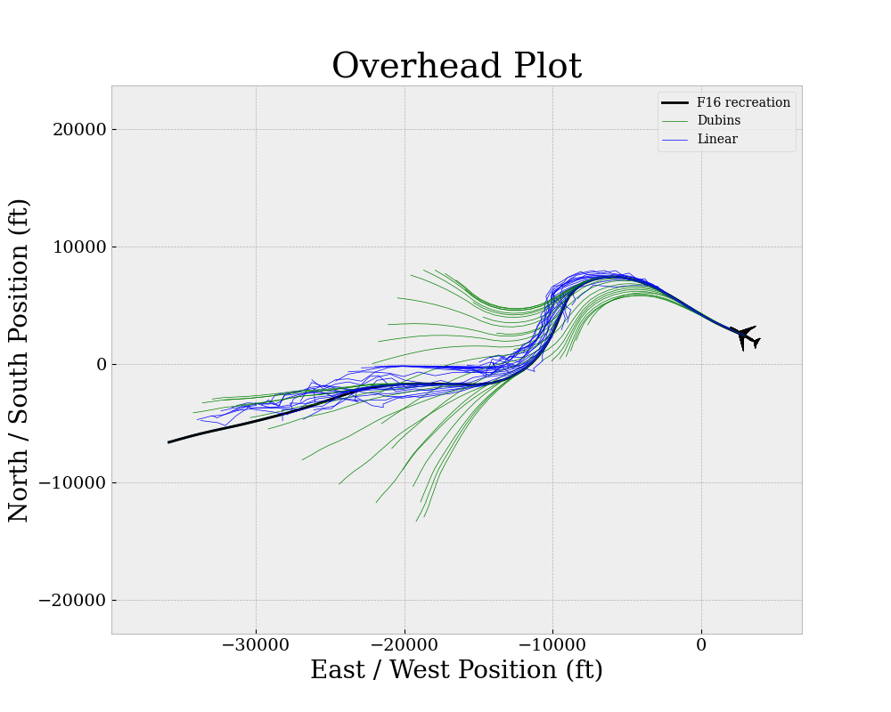


  

# AeroBenchVVPython (Safe RL)

This branch is used to compute a linear model from F-16 simulation data obtained by rollouts of the SafeRL RL controllers (Andrew's fork and branch `stan` from https://github.com/andrewmata13/SafeRL/tree/stan).

The main command to run is, from inside `code/aerobench`: `python examples/saferl/run_compare_dubins.py`

This script loads trajectory data from `dubins_data.pkl`. This data was obtained by doing 50 rollouts of a trained policy from the SafeRL repo. This `.pkl` file can be produced inside the `SafeRL/autokoopman` folder by running the `stan_manual_koopman.py`.

